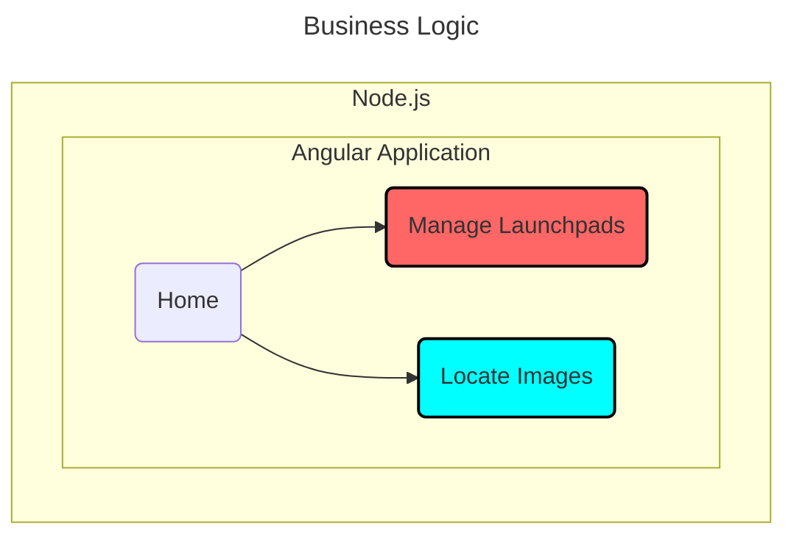

# The Recruitment Task S1
An Angular 20 + Angular Material application using [SpaceX-API queries](https://github.com/r-spacex/SpaceX-API/blob/master/docs/queries.md).

<table>
  <tr>
    <td rowspan="3"></td>
    <td></td>
    <td rowspan="3"></td>
  </tr>
  <tr>
    <td>
      Live demo&nbsp;&nbsp;➔&nbsp;&nbsp;
      <a href="https://ee-cs.github.io/RecruitmentTaskS1/">Recruitment Task S1 (GitHub Pages)</a>
    </td>
  </tr>
  <tr>
    <td></td>
  </tr>
</table>

## ❶ Architecture

## ❷ Description of the Business Logic
1. **When the "Manage Launchpads" page is selected:**
  - Performs a read operation for launchpads.
  - For each launchpad, performs a read operation for launches.
  - Implemented features:
    - Search for launchpads or launches by a fragment of the name.
    - Pagination with options for 5, 10, 20, 50, 100, or 200 items per page.
    - Default pagination: 5 items per page.
    - Sorting launchpads by id, name, region, or status.
    - Sorting launches by id, name, Wikipedia page title, or success flag.
2. **When the "Locate Images" page is selected:**
  - Loads images for launchpads, rockets, and crew.
  - Pagination with defaults: 1st page and 20 items per page.
  - Displays a table with expandable rows.
  - The detail row consists of an image column that spans across all columns.
  - Allows locating a specific image by name and displaying it.
  - Enables selecting an image name from a list of names.

The presented data is retrieved from https://api.spacexdata.com using HttpClient.

## ❸ Development

Proposed Enhancements

- Move filtering, sorting, and pagination to the server-side if the dataset grows large.

---
